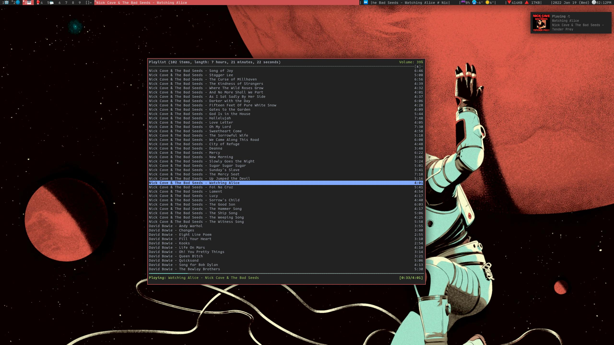
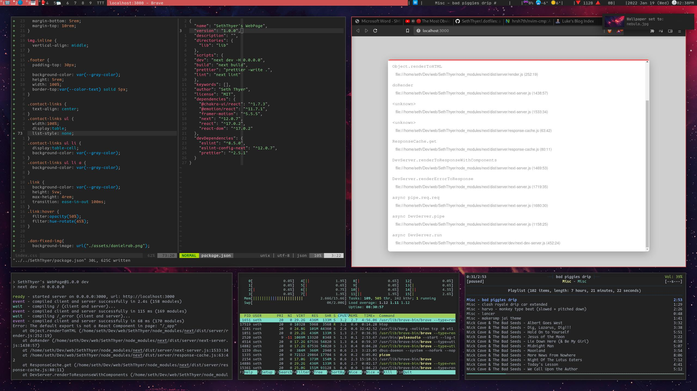
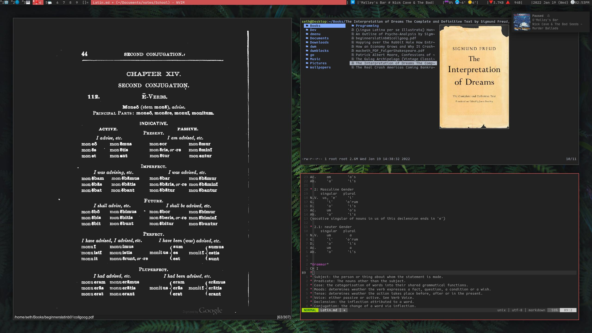

# My Dotfiles

## Includes my config files for:

- dwm-blocks (status bar)
- mpd (music-player daemon)
- ncmpcpp (music-player deamon terminal interface)
- lf (file browser)
- nvim (text-edditor / IDE)
- zathura (document viewer)
- dxhd (for more keybinds)
- alacritty (terminal emulator)
- newsboat (rss feed reader)
- dunst (notification daemon)
- picom (wm compositor)

I've also included my scripts for dwmblocks.

_a little rice here and there_

## Here are some pictures

